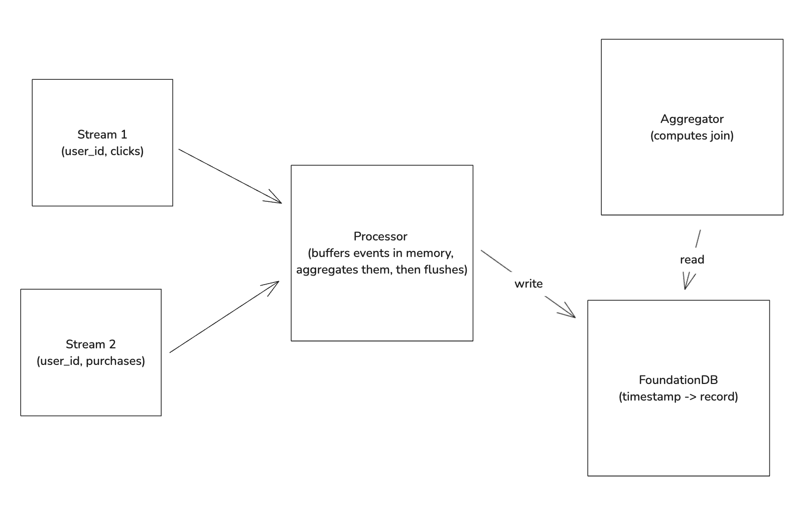

# DuckDB Streams

### Overview

This project presents a concept event/stream processing engine, built on FoundationDB and DuckDB.

The contained code intends to demonstrate that a (reasonably efficient) distributed stream processing engine could be built on the above primitives. The system simulates a workflow with two streams, with the end goal of processing a streaming join along a single key (user_id). The rough flow of an event is the following:

- An HTTP POST request is sent to the processor ("source"), which caches the event in memory under a stream ID.
- After a set amount of time has passed, the system performs an intermediate aggregation to compress all events before flushing to FDB.
- The "aggregator" periodically pulls all data associated with each stream, computes the result of the join, and prints the returned rows ("sink").

Even though constants are hardcoded into the project (stream IDs, queries, etc.), one could imagine these could be abstracted out and stored in a metadata repository/control plane.

> Why use FoundationDB?

We want to show that this design is feasible for a distributed stream processing engine, so we need a reliable distributed storage engine. Granted, the only way to show "this design is feasible for a distributed stream processing engine" is to actually build one — stay tuned!

> Why not write every event to FDB?

We could do this and it would work to an extent, but you'd eventually be bottlenecked by FDB's write throughput (90,000 w/s for the memory engine). Compressing data via intermediate aggregations means this bottleneck would be reached only if we're dealing with concurrent events containing 90,000 unique keys, a more lenient constraint.

### Benchmarking

There's a lot of work to be done here, but `bench/main.go` contains a simple script used in benchmarking the program — after running this on my workstation, it exhibited the ability to process ~50,000 events/s. Note a few things:

- The script is naive and only writes to both streams along one ID. This means the intermediate aggregations the processor completes are extremely efficient (compresses all events to one row), so we're only writing one record to FDB for each stream, per flush. That being said, FDB's memory engine is capable of supporting 90,000 writes/s, so this shouldn't be an immense bottleneck until we're processing that many unique keys.
- My workstation is powerful (16 cores, 64GB RAM). However, I didn't allocate any excess cores to the Go runtime and didn't reach anywhere near peak CPU utilization.

### Caveats/future directions

#### Guarantees

This system does not guarantee exactly-once delivery semantics (doesn't go so far as to account for it).

#### Query language

The fact that this program utilizes DuckDB might indicate an end user could write their queries in pure SQL without any extra work on the system's end. In the naive case (writing every event to FDB) this would work well, but under the current architecture this isn't feasible.

We need to execute intermediate aggregations in the processor, so these would need to be accounted for by either exposing a simple API with `key_by()`, `sum()`, etc., and reducing those operations to SQL, or writing a custom SQL parser/VM.

#### Windowing

The windowing aspect of the system is relatively naive, as everything is handled at processing time as opposed to event time. For more on how an efficient and correct system that executes streaming joins on event time could be built, I recommend [this](https://www.youtube.com/watch?v=I6MJqNAM2qU) talk by Neil Ramaswamy.

#### Distributing

I suspect distributing this to operate across an arbitrary number of streams and scale to process production-scale events would involve (at minimum) the following:

- Write a simple API exposed to an end user, write a compiler to reduce those operations to SQL queries.
- Use FoundationDB as a metadata store to match data associated with a stream to specific queries.
- Run multiple instances of the processor (could be orchestrated by Kubernetes).
- Partition streams across pods to get the most out of each intermediate aggregation.
- Utilize a queue to schedule aggregation jobs.
- Scale the aggregator (more thought required).
